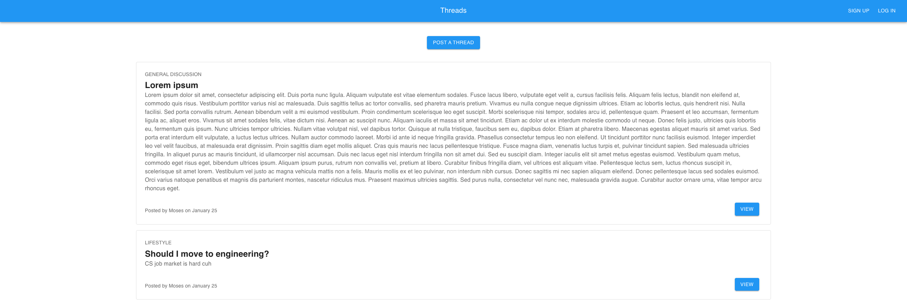

# Threads



This is a simple online forum web application where communities can share their ideas and opinions with one another. Users can create accounts to post threads and comments, all with a simple, intuitive user experience and CRUD operations available to owners of the threads and comments.

## Features

Users can:
1. read all threads;
2. read all comments on all threads;
3. sign up for and log into accounts;
4. write their own threads;
5. comment on any thread; and
6. edit or delete their thread after creation.

## Technologies Used

### Frontend

1. React.js
2. Axios
3. Material UI
4. React Router

### Backend

1. Go
2. Mux
3. JSON Web Token (Golang-JWT)
4. MySQL (Go-MySQL-Driver)

## Starting the App

### Prerequisites

The project requires [Go](https://go.dev) to be installed, as well as [Yarn](https://yarnpkg.com). Moreover, [MySQL](https://www.mysql.com) and a MySQL client (like [TablePlus](https://tableplus.com)) are also needed.

### Setup

1. Clone this repository to your local machine.
2. In your local terminal, navigate to the project directory.
3. [Start your MySQL server](https://dev.mysql.com/doc/mysql-getting-started/en/) and boot up your preferred MySQL client. Ensure the client is connected to the MySQL server by entering the port (3306 by default), root user, and password. Also, enter your password in line 28 of `/backend/config/env.go`.
4. Run the entirety of `/init.sql` using your MySQL client to initialize the database and tables needed for this project.
5. In the `/backend` folder, in a terminal, execute:

   ```bash
   go get -d ./...
   ```

   to install all dependencies of the backend.

6. Enter a JWT secret into `/backend/utils/utils.go` (line 33) and `/backend/config/env.go` (line 31).
7. Execute:

   ```bash
   go run cmd/main.go
   ```

   in the `/backend` directory to start the backend.
8. In the `/frontend` folder, in a terminal, execute:

   ```bash
   yarn install
   ```

   to install all dependencies of the frontend.
9. Execute:

   ```bash
   yarn start
   ```

   in the `/frontend` directory to start the frontend.
10. Using Google Chrome, go to [http://localhost:3000](http://localhost:3000) to visit the web app.

## About

Developed by Clement Chen.  
[LinkedIn](https://www.linkedin.com/in/clementchendra)  
[Contact](mailto:clementaditya@gmail.com)

Part of an assignment for Computing for Voluntary Welfare Organizations at the National University of Singapore.  
Last updated January 26th, 2025.

